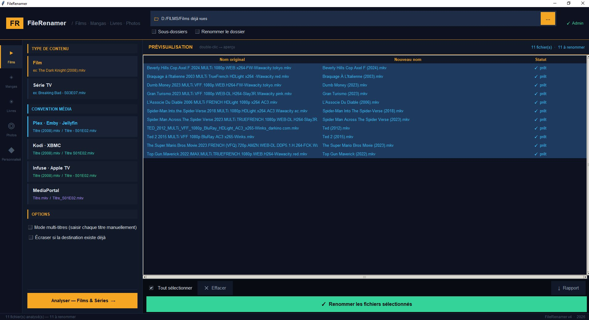
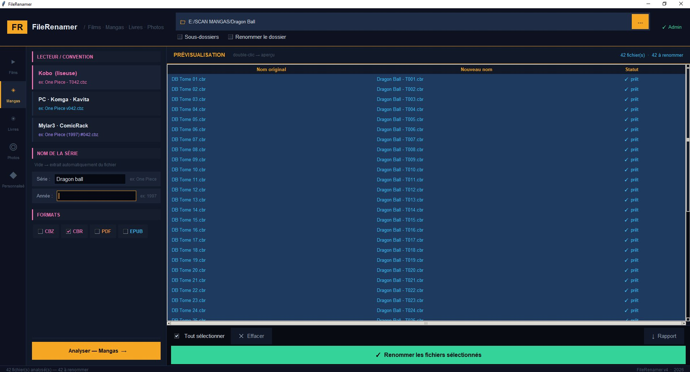

<div align="center">

# FileRenamer

**Outil de renommage multimédia Windows**

Films · Mangas · Livres · Photos

[](https://github.com/loic31000/FileRenamer/releases/latest)
[](https://python.org)
[](https://github.com/loic31000/FileRenamer/releases/latest)
[](LICENSE)

[**Télécharger le .exe**](https://github.com/loic31000/FileRenamer/releases/latest) · [Signaler un bug](https://github.com/loic31000/FileRenamer/issues) · [Demander une fonctionnalité](https://github.com/loic31000/FileRenamer/issues)

</div>

---



FileRenamer renomme automatiquement vos fichiers multimédia selon les conventions des logiciels les plus populaires. Interface sombre moderne, **prévisualisation obligatoire** avant application — zéro risque de perte.

---

## Téléchargement

| Méthode | Lien |
|---------|------|
| **.exe autonome** (recommandé) | [GitHub Releases](https://github.com/loic31000/FileRenamer/releases/latest) |
| **Code source** (Python requis) | `git clone` ou télécharger le ZIP |

> Le `.exe` est autonome, aucune installation de Python requise.

---

## Fonctionnalités

| Mode | Conventions supportées |
|------|------------------------|
| 🎬 Films & Séries | Plex · Emby · Jellyfin · Kodi · Infuse · MediaPortal |
| 🎌 Mangas | Kobo (liseuse) · PC/Komga/Kavita · Mylar3/ComicRack |
| 📚 Livres & BD | Calibre · Kobo · Kindle · Adobe Digital Editions |
| 🖼️ Photos | Renommage par date EXIF ou date fichier |
| ⚙️ Personnalisé | Template libre avec variables |

- **Prévisualisation avant application** — dry-run obligatoire, aucune surprise
- **Mode multi-titres** — saisir manuellement le titre de chaque film
- **Renommage du dossier parent** — adapté automatiquement à la convention choisie
- **Aperçu miniature** — double-clic sur une image ou CBZ pour voir la couverture
- **Sous-dossiers récursifs** — traitement en profondeur optionnel
- **Export rapport** — log `.txt` ou `.json` de chaque opération
- **Gestion admin Windows** — détection et relance UAC si accès refusé

---

## Captures d'écran

### Films & Séries — Convention Plex


Renommage de 11 films depuis un dossier `D:/FILMS`. Détection automatique du titre et de l'année depuis des noms bruts (encodeur, qualité, source...).

### Mangas — Convention Kobo



Renommage de 42 tomes Dragon Ball au format Kobo `Dragon Ball - T001.cbr`. Le nom de série est saisi manuellement, le numéro de tome est extrait automatiquement.

---

## Conventions de nommage

### Films

| Logiciel | Résultat |
|----------|---------|
| Plex · Emby · Jellyfin | `The Dark Knight (2008).mkv` |
| Kodi · XBMC | `The Dark Knight (2008).mkv` |
| Infuse · Apple TV | `The Dark Knight (2008).mkv` |
| MediaPortal | `The Dark Knight.mkv` |

### Séries TV

| Logiciel | Résultat |
|----------|---------|
| Plex · Emby · Jellyfin | `Breaking Bad - S03E07.mkv` |
| Kodi · XBMC | `Breaking Bad S03E07.mkv` |
| Infuse · Apple TV | `Breaking Bad - S03E07.mkv` |
| MediaPortal | `Breaking Bad_S03E07.mkv` |

### Mangas

| Lecteur | Résultat |
|---------|---------|
| Kobo (liseuse) | `One Piece - T042.cbz` |
| PC · Komga · Kavita | `One Piece v042.cbz` |
| Mylar3 · ComicRack | `One Piece (1997) #042.cbz` |

> **Note Mylar3** : l'année est obligatoire pour le format complet. Saisissez-la dans le champ prévu, sinon le résultat sera `One Piece #042.cbz` sans l'année.

### Livres & BD

| Logiciel | Résultat |
|----------|---------|
| Calibre | `Tolkien - Le Seigneur des Anneaux (2001).epub` |
| Kobo | `Le Seigneur des Anneaux - Tolkien.epub` |
| Kindle | `Le Seigneur des Anneaux - Tolkien.epub` |
| Adobe Digital Editions | `Tolkien - Le Seigneur des Anneaux.epub` |

### Photos

```
20231225_143022_vacances.jpg
```

Date EXIF (prise de vue) si disponible, sinon date de modification du fichier.

---

## Installation

### Option 1 — Executable .exe (recommandé)

1. Télécharger `FileRenamer-vX.X.X-Windows.zip` depuis les [Releases](https://github.com/loic31000/FileRenamer/releases/latest)
2. Extraire le ZIP
3. Double-cliquer sur `FileRenamer.exe`

Aucune installation requise. L'exe demande les droits admin automatiquement si nécessaire.

### Option 2 — Code source Python

**Prérequis** : Python 3.8+ ([python.org](https://www.python.org/downloads/))

```bash
git clone https://github.com/loic31000/FileRenamer.git
cd FileRenamer
pip install pillow          # optionnel — apercu miniature + date EXIF
python file_renamer.py
```

---

## Utilisation

1. **Choisir le dossier** à traiter (champ en haut)
2. **Sélectionner le mode** dans la barre latérale gauche (🎬 🎌 📚 🖼️ ⚙️)
3. **Choisir la convention** (Plex, Kobo, Calibre...)
4. Cliquer **Analyser** → prévisualisation dans le tableau
5. Vérifier *Nom original* / *Nouveau nom*
6. Cliquer **Renommer les fichiers sélectionnés**

### Statuts

| Couleur | Signification |
|---------|---------------|
| 🟢 Vert | Prêt à renommer |
| ⚪ Gris | Nom inchangé |
| 🟠 Orange | Fichier destination existant |
| 🔵 Cyan | Déjà renommé |
| 🔴 Rouge | Erreur |

### Mode multi-titres (Films)

Cochez **"Mode multi-titres"** pour saisir manuellement le titre et l'année de chaque film avant la prévisualisation. Utile quand les noms de fichiers sont trop dégradés pour l'extraction automatique.

### Aperçu miniature

Double-cliquez sur une ligne pour afficher la miniature d'une image ou la couverture d'un CBZ. Nécessite Pillow (`pip install pillow`).

---

## Compilation depuis les sources

```bash
pip install pyinstaller
```

Puis double-cliquer sur `build_release.bat` — il compile le `.exe`, crée un dossier `release/` et une archive ZIP prête pour GitHub Releases.

Ou manuellement :

```bash
python -m PyInstaller --onefile --windowed --uac-admin --name FileRenamer file_renamer.py
```

---

## Structure du projet

```
FileRenamer/
├── file_renamer.py          # Application principale (Python 3.8+)
├── build_release.bat        # Script de build + packaging release
├── README.md                # Ce fichier
├── screenshot_films.png     # Capture Films & Séries
└── screenshot_manga.png     # Capture Mangas
```

---

## Architecture

```
RenameEngine                      Moteur de renommage (pur Python, sans GUI)
  clean_title()                   Nettoie le titre (bruit encodeur...)
  extract_year()                  Extrait l'annee (19xx / 20xx)
  extract_season_episode()        Detecte S01E02 / 1x05
  extract_volume()                Detecte tome/vol/T15/#018
  rename_movie(convention)        Film selon convention
  rename_series(convention)       Serie selon convention
  rename_manga_kobo/pc/mylar()    Manga selon lecteur
  rename_book(author, convention) Livre selon logiciel
  rename_photo(prefix, exif)      Photo par date
  rename_custom(template)         Template personnalise

App (tk.Tk)                       Interface graphique
  _build_header()                 Header avec dossier source
  _build_nav()                    Navigation laterale iconique
  _build_all_pages()              Pages des 5 modes
  _run_preview(mode)              Previsualisation dry-run
  _apply()                        Application du renommage
  _multi_title_dialog()           Dialogue multi-titres films
  _show_preview_popup()           Apercu miniature CBZ/image
```

---

## Dépendances

| Package | Usage | Obligatoire |
|---------|-------|-------------|
| `tkinter` | Interface graphique | ✅ (stdlib Python) |
| `pillow` | Aperçu miniature, date EXIF | ⬜ Optionnel |
| `rarfile` | Aperçu couverture CBR | ⬜ Optionnel |
| `pyinstaller` | Compilation .exe | ⬜ Build only |

---

## Problèmes fréquents

### WinError 5 — Accès refusé

Windows bloque le renommage de certains fichiers (lecture seule, verrouillés).

**Solutions :**
1. Fermez les applications qui lisent les fichiers (CDisplayEx, VLC, Kobo...)
2. Relancez en administrateur (bouton ⚠ dans le header)
3. Retirez l'attribut lecture seule : `attrib -r "E:\MANGAS\*" /s`

### Titre mal extrait

Le moteur retire automatiquement les mots-clés d'encodage (1080p, BluRay, FRENCH, x264...). Si le titre reste mauvais, utilisez le **mode multi-titres** pour le saisir manuellement.

### Mylar3 sans année

Si vos fichiers ne contiennent pas d'année dans leur nom et que le champ Année est vide, le résultat sera `Série #001.cbz` sans l'année. Saisissez l'année manuellement — l'interface affiche un avertissement orange pour vous le rappeler.

---

## Licence

MIT — libre d'utilisation, modification et distribution.

---

<div align="center">

Fait avec Python · Tkinter · 2026

</div>
