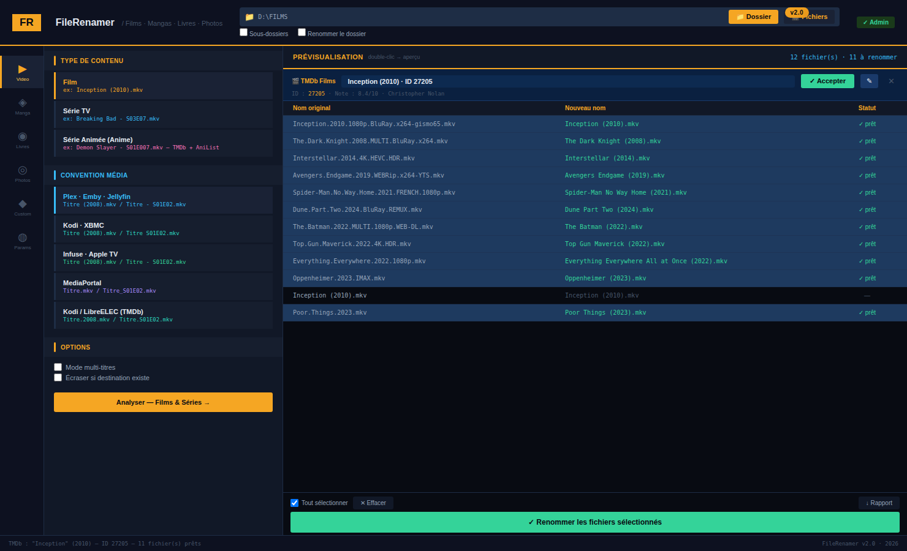
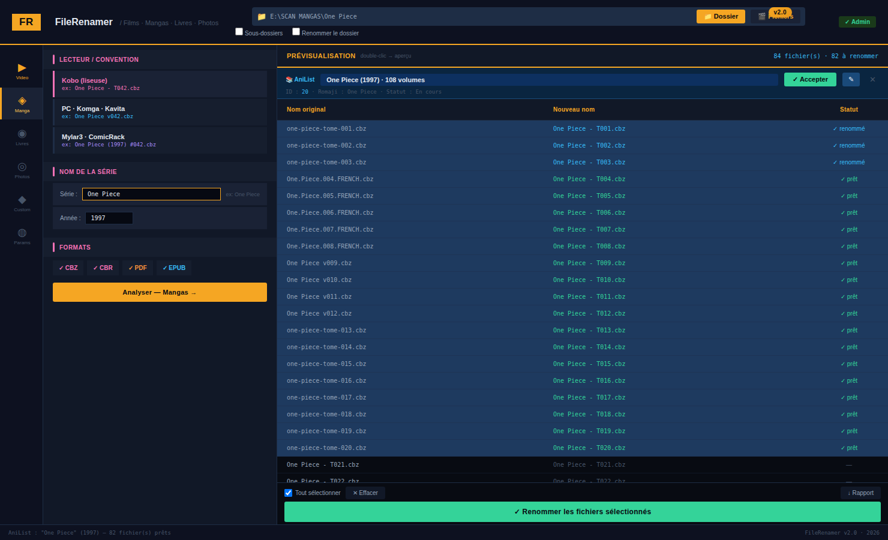

<div align="center">

# FileRenamer

**Outil de renommage multimédia Windows**  
Scraper TMDb · AniList · Open Library intégré

Films · Séries · Anime · Mangas · Livres · Photos

[](https://github.com/loic31000/FileRenamer/releases/latest)
[](https://python.org)
[](https://github.com/loic31000/FileRenamer/releases/latest)
[](LICENSE)

[**⬇️ Télécharger .exe**](https://github.com/loic31000/FileRenamer/releases/latest) · [🐛 Signaler un bug](https://github.com/loic31000/FileRenamer/issues) · [💡 Demander une fonctionnalité](https://github.com/loic31000/FileRenamer/issues)

</div>

---



FileRenamer renomme automatiquement vos fichiers multimédia selon les conventions des logiciels les plus populaires. **Scraper intégré** : détecte et vérifie le titre officiel via TMDb, AniList et Open Library. **Prévisualisation obligatoire** avant application — zéro risque de perte.

---

## ⬇️ Téléchargement

<div align="center">

### [Télécharger FileRenamer v2.0.0 — Windows (.zip)](https://github.com/loic31000/FileRenamer/releases/latest/download/FileRenamer-v2.0.0-Windows.zip)

ou [voir toutes les versions](https://github.com/loic31000/FileRenamer/releases)

</div>

<div align="center">

### ⬇️ [Télécharger FileRenamer v1.0.0 — Windows (.zip)](https://github.com/loic31000/FileRenamer/releases/latest/download/FileRenamer-v1.0.0-Windows.zip)

ou [voir toutes les versions](https://github.com/loic31000/FileRenamer/releases)

</div>

| Méthode | Lien |
|---------|------|
| **.exe autonome** (recommandé) | [FileRenamer-v2.0.0-Windows.zip](https://github.com/loic31000/FileRenamer/releases/latest/download/FileRenamer-v2.0.0-Windows.zip) |
| **.exe seul** | [FileRenamer.exe](https://github.com/loic31000/FileRenamer/releases/latest/download/FileRenamer.exe) |
| **Code source Python** | `git clone https://github.com/loic31000/FileRenamer.git` |

> Aucune installation requise — l'exe est autonome. Python recommandé pour les utilisateurs avancés.

---

## ✨ Nouveautés v2.0

### 🔍 Scraper automatique
- **Films / Séries** → [TMDb](https://www.themoviedb.org) — clé API gratuite requise
- **Anime** → TMDb + fallback [AniList](https://anilist.co) automatique
- **Mangas** → [AniList](https://graphql.anilist.co) GraphQL — **sans clé API**
- **Livres** → [Open Library](https://openlibrary.org) — **sans clé API**
- Bannière avec menu déroulant des résultats + bouton Corriger
- Se déclenche automatiquement à l'ouverture du dossier

### 🎌 Mode Anime
Nouveau type dédié aux séries animées — numérotation 3 chiffres (`S01E007`), recherche TMDb + fallback AniList.

### 🐛 Bugs corrigés
- **WinError 5 NAS/réseau** : triple méthode `os.rename → shutil.move → copy+delete`
- **Title case** : `Game of Thrones` au lieu de `Game Of Thrones`
- **Tirets releases** : `one-piece-tome-84.cbz` → titre `"One Piece"` correct
- **Auteur livres** : extraction auto depuis `"Tolkien - Titre.epub"`
- **safe_filename** : caractères remplacés par espace (plus de tirets parasites)

→ Voir [CHANGELOG.md](CHANGELOG.md) pour le détail complet.

---

## Fonctionnalités

| Mode | Scraper | Conventions |
|------|---------|-------------|
| 🎬 Films | TMDb | Plex · Emby · Jellyfin · Kodi · Infuse · MediaPortal |
| 📺 Séries TV | TMDb | Plex · Emby · Jellyfin · Kodi · Infuse · MediaPortal |
| 🎌 Série Animée | TMDb + AniList | Idem + numérotation 3 chiffres |
| 📚 Mangas | AniList | Kobo · PC/Komga/Kavita · Mylar3/ComicRack |
| 📖 Livres & BD | Open Library | Calibre · Kobo · Kindle · Adobe Digital Editions |
| 🖼️ Photos | — | Renommage par date EXIF ou date fichier |
| ⚙️ Personnalisé | — | Template libre avec variables `{titre}` `{année}` `{tome}`... |

**Également :**
- Prévisualisation avant application — dry-run, aucune surprise
- Mode multi-titres Films (saisie manuelle)
- Renommage du dossier parent
- Aperçu miniature (double-clic : image, CBZ)
- Sous-dossiers récursifs
- Export rapport `.txt` ou `.json`
- Génération `.nfo` Kodi/TMDb
- Relance automatique avec droits admin Windows (UAC)

---

## Captures d'écran

### Films avec scraper TMDb


### Mangas avec scraper AniList


---

## Configuration API TMDb

Le scraper Films & Séries nécessite une clé API TMDb **gratuite** :

1. Créer un compte sur [themoviedb.org](https://www.themoviedb.org)
2. **Paramètres → API** → Demander une clé Developer
3. Dans FileRenamer → onglet **⚙ Paramètres** → coller la clé → **Tester la connexion**

> **AniList** (mangas/anime) et **Open Library** (livres) fonctionnent **sans clé API**.

---

## Conventions de nommage

### Films

| Logiciel | Résultat |
|----------|---------|
| Plex · Emby · Jellyfin | `The Dark Knight (2008).mkv` |
| Kodi · XBMC | `The Dark Knight (2008).mkv` |
| Infuse · Apple TV | `The Dark Knight (2008).mkv` |
| MediaPortal | `The Dark Knight.mkv` |
| Kodi / LibreELEC (TMDb) | `The.Dark.Knight.2008.mkv` |

### Séries TV & Anime

| Logiciel | Résultat |
|----------|---------|
| Plex · Emby · Jellyfin | `Breaking Bad - S03E07.mkv` |
| Kodi · XBMC | `Breaking Bad S03E07.mkv` |
| Infuse · Apple TV | `Breaking Bad - S03E07.mkv` |
| MediaPortal | `Breaking Bad_S03E07.mkv` |
| Anime (3 chiffres) | `Demon Slayer - S01E007.mkv` |
| Double épisode | `Naruto - S02E012-E013.mkv` |

### Mangas

| Lecteur | Résultat |
|---------|---------|
| Kobo (liseuse) | `One Piece - T042.cbz` |
| PC · Komga · Kavita | `One Piece v042.cbz` |
| Mylar3 · ComicRack | `One Piece (1997) #042.cbz` |

> **Mylar3** : l'année est obligatoire. Saisissez-la dans le champ Année.

### Livres & BD

| Logiciel | Résultat |
|----------|---------|
| Calibre | `Tolkien - Le Seigneur des Anneaux (2001).epub` |
| Kobo | `Le Seigneur des Anneaux - Tolkien.epub` |
| Kindle | `Le Seigneur des Anneaux - Tolkien.epub` |
| Adobe Digital Editions | `Tolkien - Le Seigneur des Anneaux.epub` |

---

## Installation

### Option 1 — Executable .exe (recommandé)

1. Télécharger `FileRenamer-v2.0.0-Windows.zip` depuis les [Releases](https://github.com/loic31000/FileRenamer/releases/latest)
2. Extraire le ZIP
3. Double-cliquer `FileRenamer.exe`

### Option 2 — Code source Python

**Prérequis** : Python 3.8+ ([python.org](https://www.python.org/downloads/))

```bash
git clone https://github.com/loic31000/FileRenamer.git
cd FileRenamer
pip install pillow          # optionnel — aperçu miniature + date EXIF
python file_renamer.py
```

---

## Utilisation rapide

1. Cliquer **📁 Dossier** (ou **🎬 Fichiers** pour une sélection manuelle)
2. Sélectionner le mode dans la barre latérale gauche
3. Le scraper se déclenche → **confirmer** ou **corriger** le titre dans la bannière
4. Choisir la convention (Plex, Kobo, Calibre...)
5. Cliquer **Analyser** → vérifier la prévisualisation
6. Cliquer **Renommer les fichiers sélectionnés**

---

## Problèmes fréquents

### WinError 5 — Accès refusé (NAS, partage réseau)

**v2 : triple méthode automatique** — la plupart des cas sont résolus sans intervention.

Si l'erreur persiste :
1. Fermez les apps qui lisent les fichiers (CDisplayEx, VLC, Kobo...)
2. Cliquez ⚠ Admin dans le header pour relancer en administrateur
3. Vérifiez les droits SMB du partage (lecture+écriture requis)
4. Dernier recours : `attrib -r "E:\MANGAS\*" /s` dans un terminal admin

### Le scraper ne trouve rien

- **Films** : vérifiez la clé API TMDb dans Paramètres → Tester la connexion
- **Mangas/Anime** : AniList est gratuit — vérifiez votre connexion internet
- Utilisez **✎** dans la bannière pour corriger la query manuellement

### Titre mal extrait

Le moteur retire automatiquement : qualité (`1080p`, `4K`), source (`BluRay`, `WEBRip`), codec (`x264`, `HEVC`), langue (`FRENCH`, `MULTI`), groupes release (`-gismo65`, `-YTS`...). Si le résultat est mauvais, utilisez le **mode multi-titres** ou saisissez manuellement dans le champ Série.

### Mylar3 — année manquante

Si le champ Année est vide, le résultat sera `Série #001.cbz`. Saisissez l'année — l'interface affiche un avertissement orange.

---

## Compilation depuis les sources

```bash
pip install pyinstaller
```

Double-cliquer sur `build_release.bat` — demande la version, compile, crée le ZIP pour GitHub Releases.

```bash
# Ou manuellement :
python -m PyInstaller --onefile --windowed --uac-admin --name FileRenamer file_renamer.py
```

---

## Structure du projet

```
FileRenamer/
├── file_renamer.py       # Application principale (~2500 lignes, Python 3.8+)
├── build_release.bat     # Build + packaging release GitHub
├── CHANGELOG.md          # Historique des versions
├── README.md             # Ce fichier
├── .gitignore
├── screenshot_films_v2.png
└── screenshot_v2.png
```

## Dépendances

| Package | Usage | Obligatoire |
|---------|-------|-------------|
| `tkinter` | Interface graphique | ✅ stdlib Python |
| `pillow` | Aperçu miniature, date EXIF | ⬜ Optionnel |
| `rarfile` | Aperçu couverture CBR | ⬜ Optionnel |
| `pyinstaller` | Compilation .exe | ⬜ Build only |

**APIs externes (stdlib urllib — aucune dépendance pip) :**
- [TMDb API v3](https://developer.themoviedb.org) — Films, Séries — clé gratuite requise
- [AniList GraphQL](https://graphql.anilist.co) — Manga, Anime — sans clé
- [Open Library](https://openlibrary.org/developers/api) — Livres — sans clé

---

## Licence

MIT — libre d'utilisation, modification et distribution.

---

<div align="center">

Fait avec Python · Tkinter · TMDb · AniList · Open Library · 2026

</div>