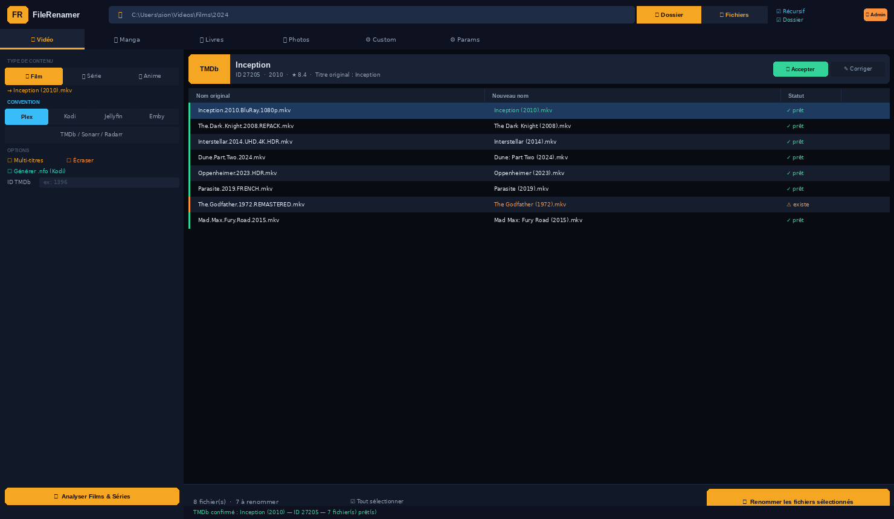
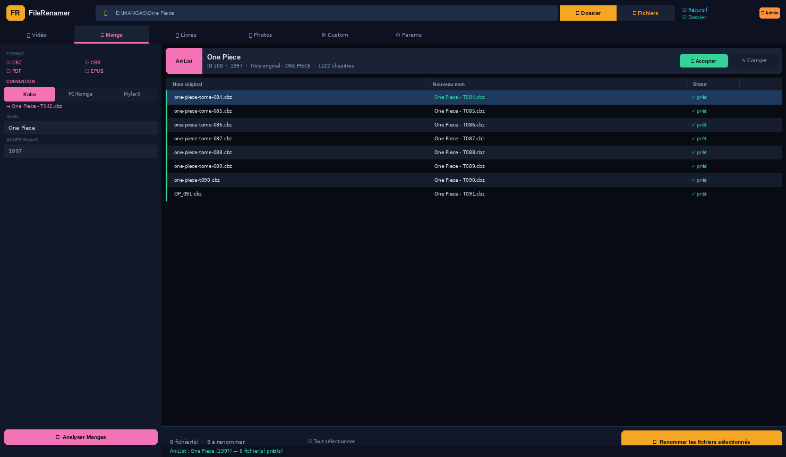

<div align="center">


# FileRenamer

**Outil de renommage multimédia Windows**  
Scraper TMDb · AniList · Open Library intégré

Films · Séries · Anime · Mangas · Livres · Photos

[](https://github.com/loic31000/FileRenamer/releases/latest)
[](https://python.org)
[](https://github.com/loic31000/FileRenamer/releases/latest)
[](LICENSE)

[**⬇️ Télécharger .exe**](https://github.com/loic31000/FileRenamer/releases/latest) · [🐛 Signaler un bug](https://github.com/loic31000/FileRenamer/issues) · [💡 Demander une fonctionnalité](https://github.com/loic31000/FileRenamer/issues)

</div>

---

## Aperçu

### 🎬 Films — scraper TMDb + conventions Plex / Kodi / Jellyfin / Emby


### 📚 Mangas — scraper AniList + conventions Kobo / PC / Mylar3


---

FileRenamer renomme automatiquement vos fichiers multimédia selon les conventions des logiciels les plus populaires. **Scraper intégré** : détecte et vérifie le titre officiel via TMDb, AniList et Open Library. **Prévisualisation complète** avant application — zéro risque de perte.

---

## ⬇️ Téléchargement

<div align="center">

### [Télécharger FileRenamer v3.0.0 — Windows (.zip)](https://github.com/loic31000/FileRenamer/releases/latest/download/FileRenamer-v3.0.0-Windows.zip)

ou [voir toutes les versions](https://github.com/loic31000/FileRenamer/releases)

</div>

| Méthode | Lien |
|---------|------|
| **.exe autonome** (recommandé) | [FileRenamer-v3.0.0-Windows.zip](https://github.com/loic31000/FileRenamer/releases/latest/download/FileRenamer-v3.0.0-Windows.zip) |
| **.exe seul** | [FileRenamer.exe](https://github.com/loic31000/FileRenamer/releases/latest/download/FileRenamer.exe) |
| **Code source Python** | `git clone https://github.com/loic31000/FileRenamer.git` |

> Aucune installation requise — l'exe est autonome. Python recommandé pour les utilisateurs avancés.

---

## ✨ Fonctionnalités

| Mode | Scraper | Conventions |
|------|---------|-------------|
| 🎬 Films | TMDb | Plex · Kodi · Jellyfin · Emby · TMDb/Radarr |
| 📺 Séries TV | TMDb | Plex · Kodi · Jellyfin · Emby · TMDb/Sonarr |
| 🎌 Série Animée | TMDb + AniList | Idem + numérotation 3 chiffres |
| 📚 Mangas | AniList | Kobo · PC/Komga/Kavita · Mylar3/ComicRack |
| 📖 Livres & BD | Open Library | Calibre · Kobo · Kindle · Adobe Digital Editions |
| 🖼️ Photos | — | Renommage par date EXIF ou date fichier |
| ⚙️ Personnalisé | — | Template libre `{titre}` `{année}` `{tome}`... |

**Également :**
- Prévisualisation avant application — dry-run, aucune surprise
- Switch de convention **en direct** sans recliquer Analyser
- Mode multi-titres Films (saisie manuelle)
- Renommage du dossier parent
- Aperçu miniature (double-clic : image, CBZ)
- Sous-dossiers récursifs
- Génération `.nfo` Kodi/TMDb
- Relance automatique avec droits admin Windows (UAC)

---

## ✨ Nouveautés v3.0

- **Conventions sur 2 lignes** : Plex / Kodi / Jellyfin / Emby + TMDb·Sonarr·Radarr — plus de label tronqué
- **Switch convention en direct** : la prévisualisation se met à jour immédiatement sans recliquer Analyser
- **Cache scraper** : le titre TMDb/AniList est conservé quand on change de convention
- **Icône intégrée** : `icon.ico` embarqué dans le .exe — affiché dans la titlebar et la taskbar Windows
- **Correction fermeture** : l'application ne se reouvrait plus au premier clic sur la croix
- **Conventions TV officielles** corrigées :
  - Plex → `Titre - s01e01.mkv` (tiret + minuscules)
  - Kodi / Jellyfin / Emby → `Titre S01E01.mkv` (pas de tiret)
  - TMDb / Sonarr / Radarr → `Titre.S01E01.mkv` (points)

→ Voir [CHANGELOG.md](CHANGELOG.md) pour le détail complet.

---

## Conventions de nommage

### Films

| Logiciel | Résultat |
|----------|---------|
| Plex · Kodi · Jellyfin · Emby | `The Dark Knight (2008).mkv` |
| TMDb · Radarr | `The.Dark.Knight.2008.mkv` |

### Séries TV

| Logiciel | Résultat |
|----------|---------|
| **Plex** | `Breaking Bad - s03e07.mkv` (tiret + minuscules) |
| **Kodi · Jellyfin · Emby** | `Breaking Bad S03E07.mkv` |
| **TMDb · Sonarr** | `Breaking.Bad.S03E07.mkv` |
| Anime (3 chiffres) | `Demon Slayer - s01e007.mkv` |
| Double épisode | `Naruto - s02e012-e013.mkv` |

### Mangas

| Lecteur | Résultat |
|---------|---------|
| Kobo | `One Piece - T042.cbz` |
| PC · Komga · Kavita | `One Piece v042.cbz` |
| Mylar3 · ComicRack | `One Piece (1997) #042.cbz` |

> **Mylar3** : l'année est obligatoire. Saisissez-la dans le champ Année si elle n'est pas détectée automatiquement.

### Livres & BD

| Logiciel | Résultat |
|----------|---------|
| Calibre | `Tolkien - Le Seigneur des Anneaux (2001).epub` |
| Kobo · Kindle | `Le Seigneur des Anneaux - Tolkien.epub` |
| Adobe Digital Editions | `Tolkien - Le Seigneur des Anneaux.epub` |

---

## Configuration API TMDb

Le scraper Films & Séries nécessite une clé API TMDb **gratuite** :

1. Créer un compte sur [themoviedb.org](https://www.themoviedb.org)
2. **Paramètres → API** → Demander une clé Developer
3. Dans FileRenamer → onglet **⚙ Paramètres** → coller la clé → **Tester la connexion**

> **AniList** (mangas/anime) et **Open Library** (livres) fonctionnent **sans clé API**.

---

## Installation

### Option 1 — Executable .exe (recommandé)

1. Télécharger `FileRenamer-v3.0.0-Windows.zip` depuis les [Releases](https://github.com/loic31000/FileRenamer/releases/latest)
2. Extraire le ZIP
3. Double-cliquer `FileRenamer.exe`

> Windows peut afficher un avertissement SmartScreen au premier lancement (application non signée). Cliquer **Informations complémentaires → Exécuter quand même**.

### Option 2 — Code source Python

**Prérequis** : Python 3.8+ ([python.org](https://www.python.org/downloads/))

```bash
git clone https://github.com/loic31000/FileRenamer.git
cd FileRenamer
pip install pillow          # optionnel — aperçu miniature + date EXIF
python file_renamer.py
```

---

## Utilisation rapide

1. Cliquer **📁 Dossier** (ou **🎬 Fichiers** pour une sélection manuelle)
2. Sélectionner le mode dans la barre d'onglets (Vidéo / Manga / Livres...)
3. Le scraper se déclenche automatiquement → **confirmer** ou **corriger** le titre
4. Choisir la convention (Plex, Kodi, Kobo, Calibre...)
5. Cliquer **Analyser** → vérifier la prévisualisation
6. Cliquer **Renommer les fichiers sélectionnés**

---

## Problèmes fréquents

### WinError 5 — Accès refusé (NAS, partage réseau)

Triple méthode automatique : `os.rename` → `shutil.move` → `copy + delete`. La plupart des cas sont résolus sans intervention.

Si l'erreur persiste :
1. Fermer les apps qui lisent les fichiers (CDisplayEx, VLC, Kobo...)
2. Cliquer **⚠ Admin** dans le header pour relancer en administrateur
3. Vérifier les droits SMB du partage (lecture + écriture requis)

### Le scraper ne trouve rien

- **Films / Séries** : vérifier la clé API TMDb dans Paramètres → Tester la connexion
- **Mangas / Anime** : AniList est gratuit — vérifier la connexion internet
- Utiliser **✎ Corriger** dans la bannière pour ajuster la query manuellement

### Titre mal extrait

Le moteur retire automatiquement : qualité (`1080p`, `4K`), source (`BluRay`, `WEBRip`), codec (`x264`, `HEVC`), langue (`FRENCH`, `MULTI`), groupes release. Utiliser **✎ Corriger** si le résultat est incorrect.

---

## Compilation depuis les sources

Double-cliquer sur `build_release.bat` — détecte Python automatiquement, compile avec PyInstaller, crée le ZIP pour GitHub Releases.

```bash
# Ou manuellement :
pip install pyinstaller
python -m PyInstaller --onefile --windowed --uac-admin --name FileRenamer --icon icon.ico file_renamer.py
```

---

## Structure du projet

```
FileRenamer/
├── file_renamer.py         # Application principale (Python 3.8+, ~2600 lignes)
├── icon.ico                # Icône multi-résolution (16–256px)
├── icon_48.png             # Icône 48px pour le header de l'app
├── build_release.bat       # Build + packaging release GitHub
├── version_info.txt        # Métadonnées Windows pour le .exe
├── screenshot_v3_films.png # Capture d'écran mode Films
├── screenshot_v3_manga.png # Capture d'écran mode Manga
├── CHANGELOG.md            # Historique des versions
├── README.md               # Ce fichier
└── LICENSE                 # Licence MIT
```

## Dépendances

| Package | Usage | Obligatoire |
|---------|-------|-------------|
| `tkinter` | Interface graphique | ✅ stdlib Python |
| `pillow` | Aperçu miniature, EXIF, icône header | ⬜ Optionnel |
| `rarfile` | Aperçu couverture CBR | ⬜ Optionnel |
| `pyinstaller` | Compilation .exe | ⬜ Build only |

**APIs externes (stdlib `urllib` — aucune dépendance pip) :**
- [TMDb API v3](https://developer.themoviedb.org) — Films, Séries — clé gratuite requise
- [AniList GraphQL](https://graphql.anilist.co) — Manga, Anime — sans clé
- [Open Library](https://openlibrary.org/developers/api) — Livres — sans clé

---

## Licence

Ce projet est sous licence [MIT](LICENSE) — libre d'utilisation, modification et distribution.

---

<div align="center">

Fait avec Python · Tkinter · TMDb · AniList · Open Library · 2026

</div>